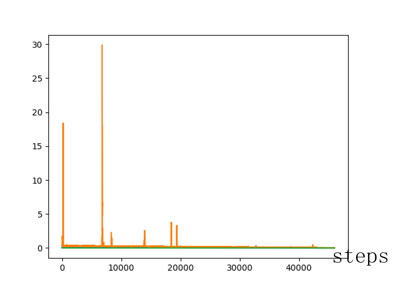
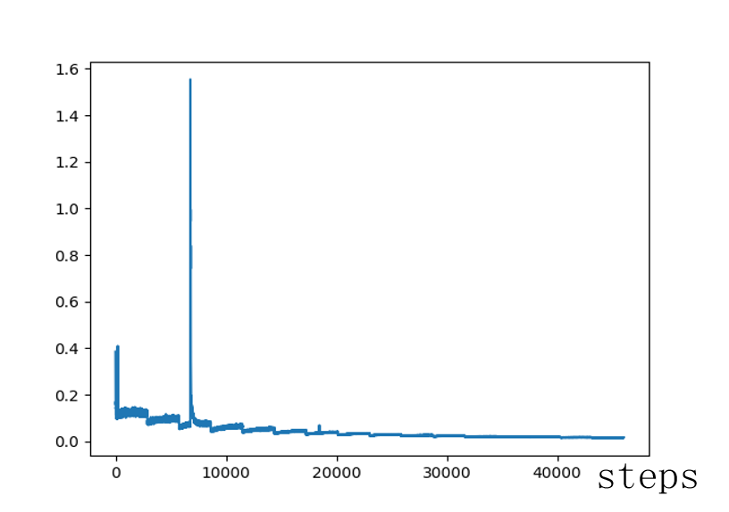

**细胞类型特异的Enhancer 生成**

**2025-11-24**

****
**任务描述**

本任务基于Genos模型\[1\]对于基因组的大量预训练积累，通过对增强子（Enhancer）数据\[2\]的继续预训练，获得增强子生成模型，实现增强子序列生成。其科学意义在于构建了细胞类型和细胞活性表达到增强子序列之间的泛映射关系，实现了基于细胞类型生成多种增强子序列的功能，为研究基于细胞类型的增强子活性值表达提供了通用工具。

**结论概要**

本研究基于Genos模型，通过在EnhancerAtlas 2.0增强子数据集\[3\]上进行继续预训练，构建了根据细胞类型与活性信息生成增强子序列的CPT模型。评测表明，相比基础模型Genos，CPT模型生成的序列在BLAST\[4\]比对中显著提升高覆盖度与高相似性匹配数量，在Motif\[5\]特征上展现出更高的Jaccard指数与LCS比例，验证了其生成序列的细胞类型特异性和生物学合理性。

**输入与输出**

本任务属于生成任务。任务输入是增强子细胞信息，包含细胞类型、细胞活性分箱和部分起始序列，输出是增强子序列（当前版本支持定长生成），通过设置不同的模型生成参数，模型支持单条序列生成和多条序列生成。模型生成的核心是学习增强子细胞信息到序列结构之间的拓扑关系。

**数据来源**

训练数据来源于公共数据库EnhancerAtlas 2.0（The Wilmer Eye Institute, 2019，http://www.enhanceratlas.org），基于hg19参考基因组\[7\]，共提取4,035,437增强子参考序列。增强子参考序列覆盖197种细胞类型，总计9,918,133,647 bp，序列长度范围为10--31,210,920 bp。

参考增强子源于ENCODE数据库(The ENCODE Project Consortium；2020)(https://www.encodeproject.org)。基于hg38参考基因组\[8\]，获得961,227条增强子参考序列。通过与Motif 数据库HOCOMOCOv11\_full\_HUMAN\_ mono(Russian Academy of Sciences，2017，https://hocomoco13.autosome.org)比对，计算生成序列中包含的Motif 数量与特征。

**模型设计**

-   **下游模型架构设计**

模型在预训练Genos-10B 8k基础上，采用继续预训练过程，完成在增强子数据的训练任务。通过数值分箱和词表扩展，将细胞类型和细胞活性值表达作为特殊token，添加到token词表，用于模型学习该类信息的embedding表达，捕捉细胞信息到增强子序列之间的映射关系。

-   **训练策略与优化**

训练过程是基于HuggingFace框架，采用DeepSpeed Zero-1并行化策略，执行继续预训练任务。考虑到Token词表扩展，在Transformer读取Checkpoint后，对模型参数尺寸进行重构，使得模型Embedding融入新增特殊Token信息。模型Attention 采用Mask 机制，使得模型能够学习生成序列的能力。

-   **训练任务**

模型训练基于Z2000完成，训练8个周期，训练Tokens数量达到40B，学习率和训练loss 如下所示：

  
  

图1. 学习率与loss曲线。随着训练步数增加，学习率保持稳定，模型loss呈现稳定下降趋势。当训练步数达到30000时，模型loss 趋于收敛。

&nbsp;

**评测指标**

针对CPT模型生成的序列，采用Blast序列比对方法和Motif模式特征方法进行分析，评估生成序列的生物学合理性与可信度。

-   **Blast**：通过与已知增强子序列集合进行blastn比对，判断该序列是否为高可信度增强子序列。

1.**覆盖度（Coverage）**：表示查询序列（query）被成功比对到目标序列（subject）的比例，定义如下：

   $$
   \text{Coverage} = \frac{\text{比对区域的长度}}{\text{查询序列的总长度}} \times 100\%
   $$

2.**同一性 / 序列相似性（Identity）**：表示在比对区域内，查询序列与目标序列完全一致的碱基数占比，定义如下：

   $$
\text{Identity} = \frac{\text{相同碱基的数量}}{\text{比对区域的长度}} \times 100\%
   $$

-   **Motif**：生成序列包含与真实增强子序列拥有相似的 motif 特征，则可视该序列为高可信度增强子。
    1.  基于人类motif 数据库HOCOMOCO，利用MEME FIMO，提取CPT模型生成序列的 motif 特征。基于贡献模式与排列顺序，对motif特征进行计算；

    2.  Jaccard index：衡量两个 motif 集合间的重叠程度，反映共有motif组合占所有motif类型的比例，定义如下：
$$Jaccard\ index\  = \ \frac{\mid A \cap B \mid}{\mid A \cup B \mid} \times 100\%$$
    
    3.  最长共同子序列比例（LCS ratio）：衡量两个 motif 序列在顺序上的相似度，相同 motif出现的顺序越相同，该值越高，定义如下：
$$LCS\ ratio\  = \ \frac{共同最长子字符串长度}{较长字符串长度} \times 100\%.$$

<!-- -->

**评测**

-   **Blast比对**

-   set2set（ENCODE database based）

  

表1. CPT模型生成序列集的blast比对。Prompt序列长度设置为30bp，CPT模型生成的序列经过BWA过滤，获取159584条可靠序列。参考ENCODE数据集，CPT模型生成的高质量enhancer 序列数量多于基础模型生成的enhancer序列。当identity95%&coverage95%时，CPT模型的生成能力超过基础模型10倍。

-   seq2seq（target sequence based）

  

表2. CPT模型生成序列的blast比对。Prompt序列长度设置为30bp，CPT模型生成enhancer 能力在不同置信度（identity & coverage）下均优于基础模型。当identity95%&coverage95%时，CPT模型的生成能力超过基础模型10倍。

-   **Motif比对(**prompt=30bp**)**

 

  

表3. CPT模型生成序列的Motif特性比对。参考HOCOMOCO，验证集涵盖12个细胞类型，27695条序列。基于不同可靠性阈值（Jaccard index/LCS ratio），CPT模型的生成能力均优于基础模型。

-   **分析验证**

    参考序列：seq\_103539为例。

    参考增强子：EH38D2920180::chr17:28908863-28909208

-   **Base Model**

1.  Blast比对：no significant match。

2.  Motif模式：序列检测到5个motif，不符合检索过程中设定的最低motif数量要求

3.  生成序列多为重复序列，生物学价值较小

-   **CPT model**

1.  Blast比对
 

  

表4. seq\_103539的blast分析。

2.  Motif模式：106 个 motif，LCS ratio=0.9639, motif jaccard=0.9358。

**参考文献**

1.  Genos Team, Hangzhou, China, Genos: A Human-Centric Genomic Foundation Model, 2025

2.  Khoury G, Gruss P., Enhancer Elements, Cell, 1983,33(2):313-314

3.  Gao T, Qian J., EnhancerAtlas 2.0: An Updated Resource with Enhancer Annotation in 586 Tissue/Cell Types Across Nine Species, Nucleic Acids

    Research, 2020,48(D1):D58-D64

4.  Boratyn G M, Camacho C, Cooper P S, et al., BLAST:A More Efficient Report with usability improvements, Nucleic acids research, 2013,41(W1):W29-W33

5.  D\'haeseleer, P., What are DNA sequence motifs? Nat. Biotechnol,

    2006,24:423-425

6.  The ENCODE Project Consortium., Moore, J.E., Purcaro, M.J. et al., Expanded encyclopaedias of DNA elements in the human and mouse genomes, Nature, 2020,583:699-710.

7.  Church DM, Schneider VA, Graves T, et al., Modernizing reference

    genome assemblies, Plos. Biology, 2011,9(7):e1001091

8.  Guo, Yan et al.,Improvements and impacts of GRCh38 human reference on high throughput sequencing data analysis, Genomics,2017,109(2):

    83-90

****
